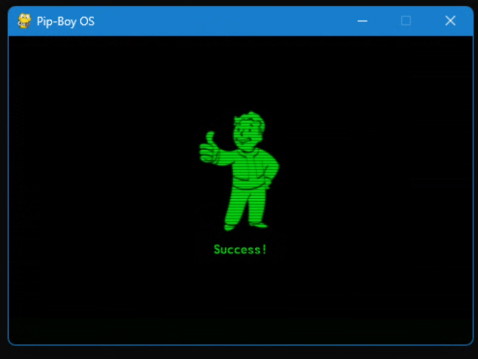
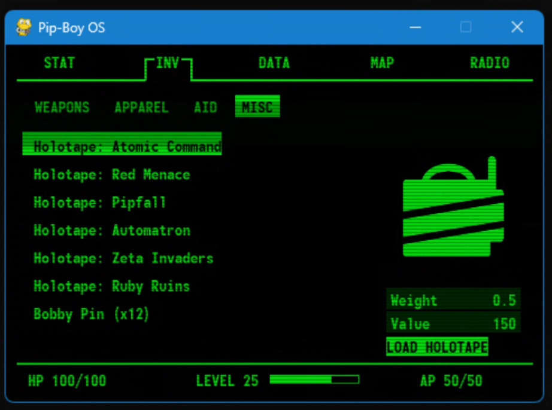
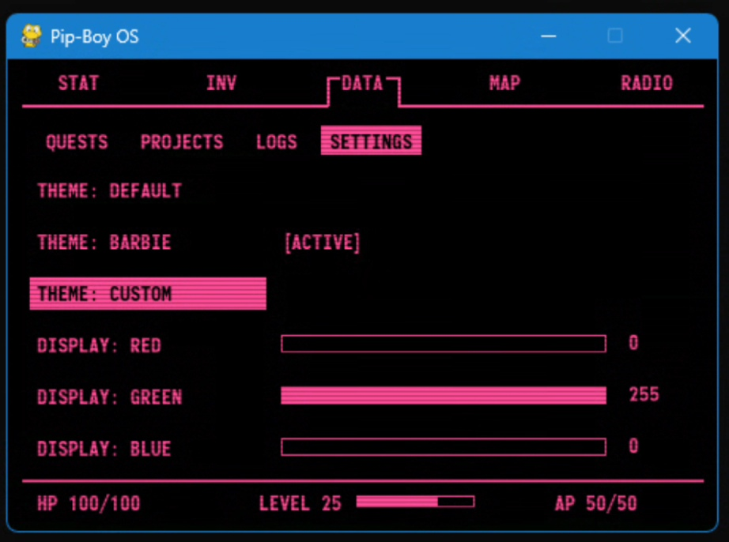
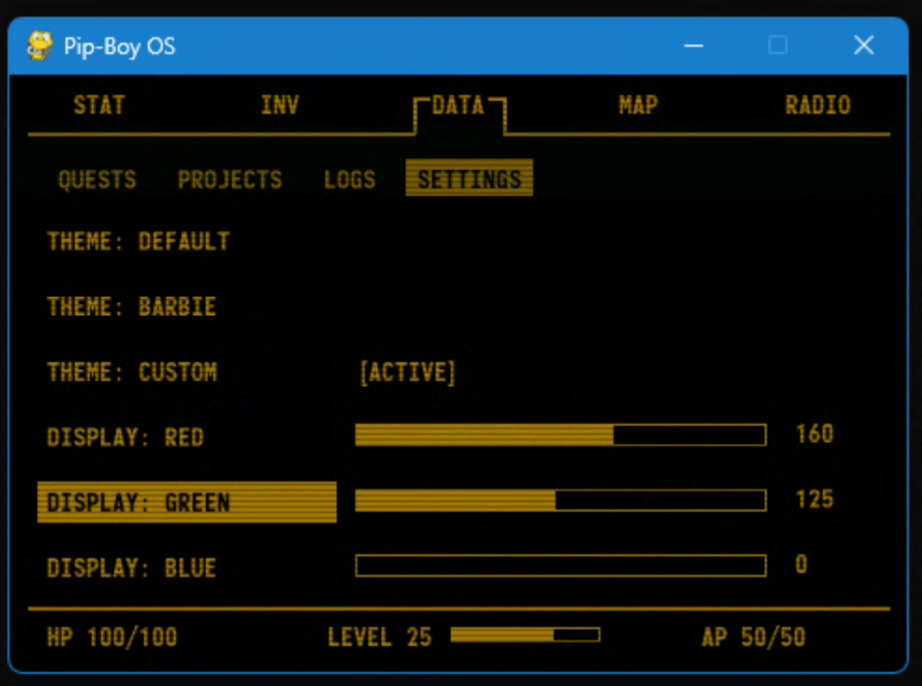
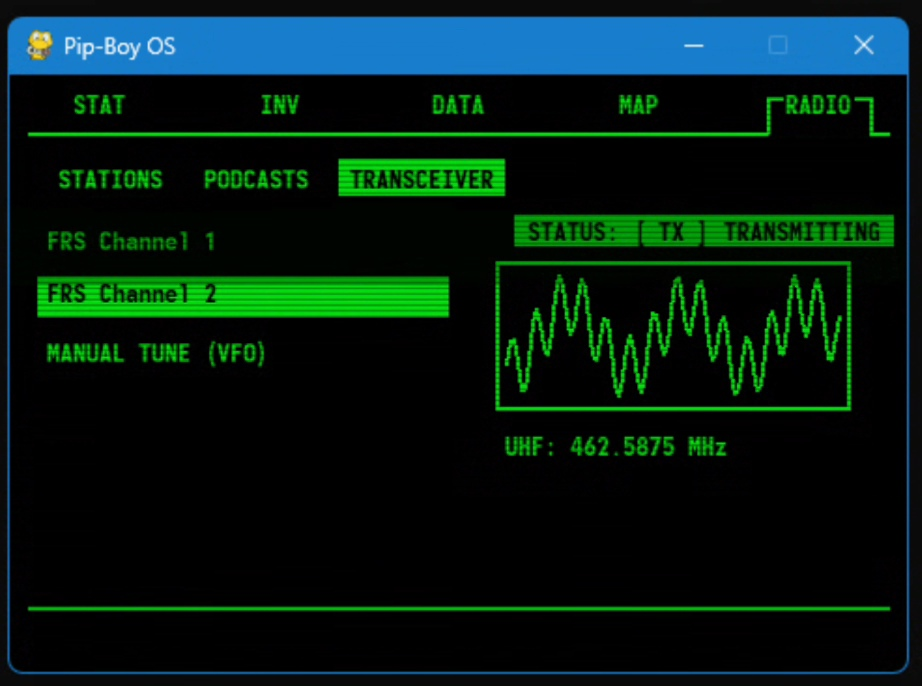
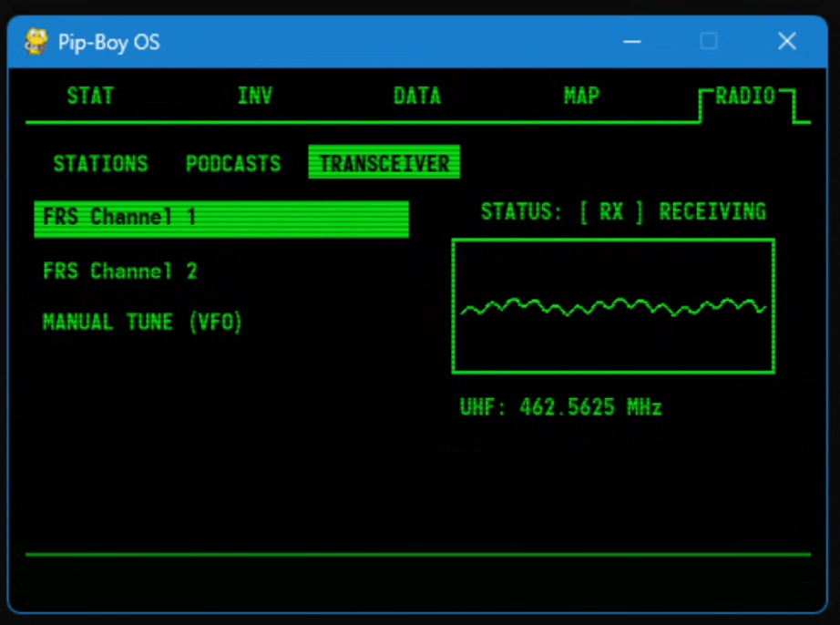
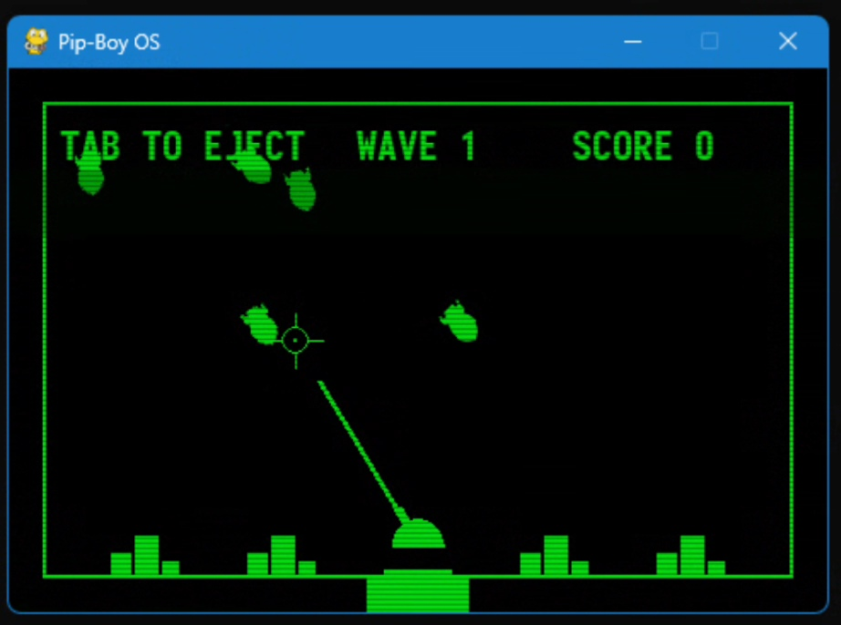
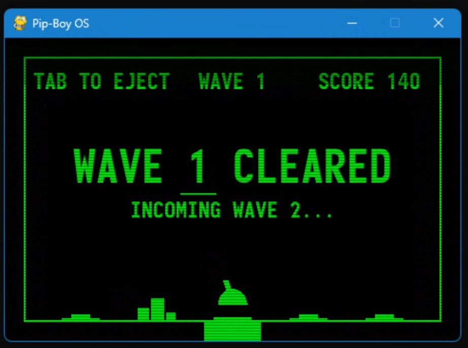
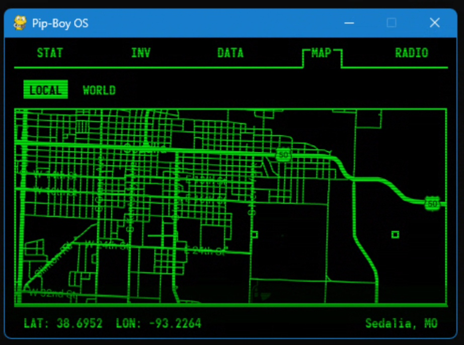
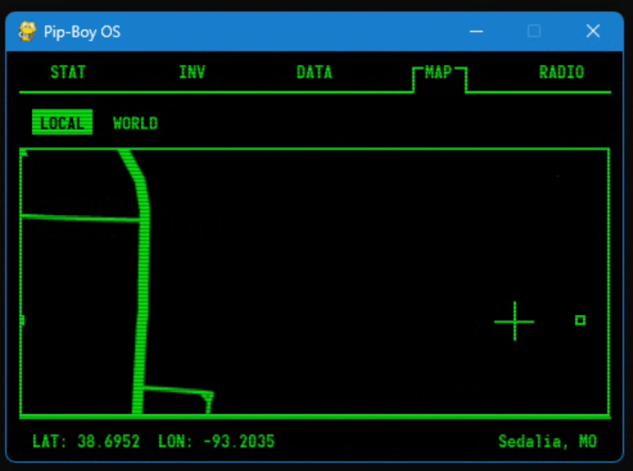

# Pip-Boy OS

A Fallout-inspired wearable operating system built with Python and Raspberry Pi, combining immersive UI design with real-world functionality like mapping, radio communication, and modular mini-games.

---

## 🎬 Demo

> ⚡ 23-second demo showcasing UI navigation, dynamic themes, radio TX/RX, mapping, and integrated mini-games

[](https://github.com/Drathe804/PipBoyOS/releases/download/Pip-Boy_OS_Demo/pipboy_demo.mp4)

---

## 🚀 Overview

Pip-Boy OS is a custom-built interactive system inspired by the Pip-Boy from Fallout.

The goal was not just to recreate the look of the UI, but to build something that behaves like a real device:

- Modular systems  
- Dynamic UI  
- Interactive elements  
- Expandable hardware integration  

Originally created for cosplay and conventions, it has evolved into a full **software + hardware system**.

---

## 🧩 Features

### 🎨 Dynamic Theme System
- Full-screen real-time RGB theming (inspired by Fallout 4)
- Preset themes (default green, Barbie theme, custom themes)
- Entire UI updates consistently across all systems, including mini-games

### 📡 Radio System
- Station selection interface
- TX / RX state switching
- Waveform visualization
- Frequency display
- Designed for real-world radio module integration (SA818-U)

### 🗺️ Mapping System
- Coordinate-based map rendering
- Zoom and cursor movement
- Persistent markers
- Edge-aware marker display

### 🎮 Mini-Games (Holotapes)
- Atomic Command (fully playable)
- Red Menace (in progress)
- Holotape-based system designed for future NFC integration

### 🎒 Inventory System
- Categorized item lists
- Holotape selection interface
- Context panels and navigation

### 🧠 STAT System
- SPECIAL stat display
- Perk system framework
- Fallout-style layout and UI behavior

### ⚙️ Boot System
- RobCo-style startup sequence
- CRT-inspired transitions and effects
- Simulated system initialization

---

## 🧰 Hardware Status

### ✅ Currently Implemented
- Raspberry Pi deployment
- Connected display
- 4 rotary encoders fully functional:
  - Navigation
  - Selection
  - Cursor movement
  - Dedicated radio control input

### 🔧 In Progress
- Microcontroller integration
- Fullscreen auto-boot behavior
- SA818-U radio module integration

### 🔮 Planned
- NFC holotapes (physical media interaction)
- Fully wearable Pip-Boy casing
- Expanded hardware controls

---

## 🖼️ Gallery

### 🖥️ Core Interface
<p align="center">
  
</p>

---

### 🎨 Dynamic Themes
<p align="center">
  
  
</p>

---

### 📡 Radio System
<p align="center">
  
  
</p>

---

### 🎮 Mini-Games
<p align="center">
  
  
</p>

---

### 🗺️ Mapping System
<p align="center">
  
  
</p>

---

## 🛠️ Tech Stack

- Python  
- Pygame  
- Raspberry Pi  
- JSON (data/configuration)  
- Planned: Arduino / microcontrollers, NFC  

---

## 🧠 Design Philosophy

- **Immersion first** — UI behaves like a real Pip-Boy  
- **System over screens** — everything is interconnected  
- **Expandable architecture** — built to evolve with hardware  
- **Fun + functional** — blending real-world utility with game design  

---

## ⚔️ Challenges Solved

- Maintaining consistent UI across dynamic theme changes  
- Handling coordinate-based map rendering with persistent markers  
- Designing a system-driven UI instead of static screens  
- Simulating radio transmission states visually  
- Integrating mini-games into a unified OS  

---

## 🔮 Future Plans

- NFC holotapes for physical game/media interaction  
- Fully wearable Pip-Boy casing  
- Real radio communication via SA818-U  
- Smartwatch integration (health, stats, tracking)  
- Quest system expansion  

---

## ▶️ Running the Project

```bash
python PipBoyOS.py
